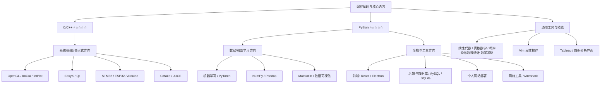

🧑💻 关于我

你好！我是拉玛，一名热爱技术探索的大二学生，目前正在系统性地构建自己的技术栈，并涉足多个领域，包括底层开发、图形学、嵌入式、机器学习与全栈应用等。乐于动手实践，享受从原理到实现的过程。

🌱 当前学习中：

🛠️ 技术栈概览

| 领域 | 技术 / 工具 | 熟悉程度 | 说明 |
|--------------|----------------------------------|----------|--------------------------|
| 编程语言 | C / C++ | ⭐☆☆☆☆ | 基本会用，能看懂 |
| | Python | ⭐☆☆☆☆ | 用于机器学习、数据分析、脚本工具 |
| | Pytorch / NumPy / Pandas / Matplotlib | ⭐☆☆☆☆ | 数据处理、分析与可视化 |
| 图形与界面 | OpenGL / ImGui / ImPlot | ⭐☆☆☆☆ | 图形渲染、即时模式 GUI |
| | EasyX / Qt | ⭐☆☆☆☆ | 图形库、跨平台桌面应用开发 |
| 嵌入式/IoT | STM32 / ESP32 / Arduino | ⭐☆☆☆☆ | 微控制器开发、物联网原型 |
| 全栈开发 | React / Electron | ⭐☆☆☆☆ | 现代前端、跨平台桌面应用 |
| | MySQL / SQLite | ⭐☆☆☆☆ | 数据库设计与基础操作 |
| | 个人网站部署 | ⭐⭐☆☆☆ | 拥有线上可访问的个人项目站点 |
| 开发工具 | CMake / Vim | ⭐☆☆☆☆ | 构建系统、高效文本编辑 |
| | Wireshark | ⭐☆☆☆☆ | 网络协议分析基础 |
| | JUCE | ⭐☆☆☆☆ | 音频应用框架初探 |
| | Tableau | ⭐☆☆☆☆ | 数据可视化与报表初步 |

[

📫 联系与交流

• 🙋♂️ 欢迎技术交流、合作或指教！  

• ✉️ 邮箱：jiuyier7@163.com  

• 💬 座右铭：“学如登山，拾级而上”  

本 README 持续更新中，记录成长路上的每一个脚印 🚀
