## Hi there 👋

<!--
**rvirtualea9/rvirtualea9** is a ✨ _special_ ✨ repository because its `README.md` (this file) appears on your GitHub profile.

Here are some ideas to get you started:

<<<<<<< HEAD
- 🔭 I’m currently working on ...
- 🌱 I’m currently learning ...
- 👯 I’m looking to collaborate on ...
- 🤔 I’m looking for help with ...
- 💬 Ask me about ...
- 📫 How to reach me: ...
- 😄 Pronouns: ...
- ⚡ Fun fact: ...
-->
=======
## 🌱 当前学习轨迹

```mermaid
graph LR
A[编程基础] --> B[C/C++]
A --> C[Python]
A --> D[Web开发]
D --> E[HTML]
D --> F[CSS]
D --> G[JavaScript]
A --> H[游戏开发]
H --> I[Unity]
```

## 🛠️ 技术栈
| 类别       | 技术                  | 掌握程度 |
|------------|-----------------------|----------|
| 编程语言   | C, C++, Python        | ⭐☆☆☆☆    |
| 前端       | HTML, CSS, JavaScript | ⭐☆☆☆☆    |
| 游戏开发   | Unity                 | ⭐⭐☆☆☆    |

## 📫 联系我
- 🙋‍♂️ 欢迎指教与交流！
- ✉️ 邮箱: verstop9000@gmail.com
- 💬 座右铭: "学如拉玛，不拉则玛"
>>>>>>> f50a987 (Update README.md)
